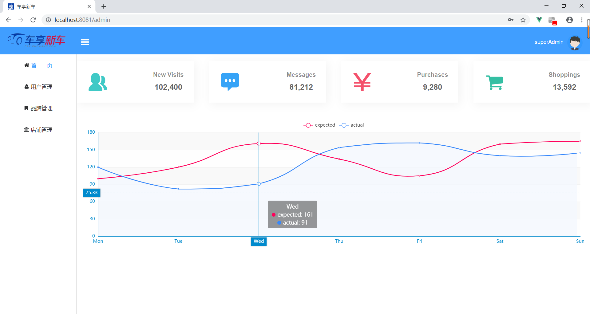

[中文用户请点](./README_CN.md)

# CarShop
A simple online automobile sales system which of Data Course Design in Junior

# Browser
Based on Vue.js+ElementUI [Source Code](https://github.com/lamprose/CarShop/tree/browser)

# Server

Based on SpringBoot [Source Code](https://github.com/lamprose/CarShop/tree/server)

---
## Screenshots

#### Home Page:

#### Admin Page:

## Contributor

### Broswer

### Server

## License

[MIT](./LICENSE)  
Copyright (c) 2017-present lamprose