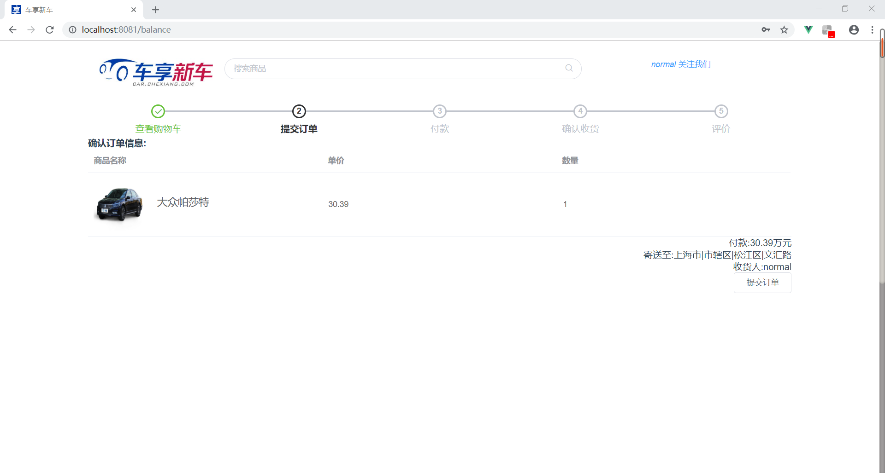

[中文用户请点](./README_CN.md)


## Browser
Based on Vue.js+ElementUI 

## Preparation
You need install node.js and git in your own computer, The project is based on ES2015+, vue, vuex, vue-router, axios and element-ui.Understanding and learning this knowledge in advance will greatly help the use of this project.

## Project Structure
This project has built the following templates, and have built a scaffold based on Vue, which should help you prototyping production-ready admin interfaces. It covers almost everything you need.
```text
├── build                      // webpack config files
├── config                     // main project config
├── src                        // main source code
│   ├── api                    // api service
│   ├── assets                 // module assets like fonts,images (processed by webpack)
│   ├── components             // global components
│   ├── directive              // global directive
│   ├── filters                // global filter
│   ├── icons                  // svg icons
│   ├── mock                   // mock data
│   ├── router                 // router
│   ├── store                  // store
│   ├── styles                 // global css
│   ├── utils                  // global utils
│   ├── views                  // views
│   ├── App.vue                // main app component
│   ├── main.js                // app entry file
│   └── permission.js          // permission authentication
├── static                     // pure static assets (directly copied)
│   └── Tinymce                // rich text editor
├── .babelrc                   // babel config
├── .eslintrc.js               // eslint config
├── .gitignore                 // sensible defaults for gitignore
├── favicon.ico                // favicon ico
├── index.html                 // index.html template
└── package.json               // package.json
```
## Getting started
```text
# clone the project
git clone -b browser https://github.com/lamprose/CarShop.git

# install dependency
npm install

# change server ip (loc:./src/config/index.js)
serverIp:'localhost'  //change 'localhost' to the real server IP, such as '192.168.0.1'

# develop
npm run dev
```
This will automatically open [http://localhost:8081](http://localhost:8081).

I have encountered some problems in the development process and solutions, I hope it can help you:

- [Front-end and Back-end CROS Problems](https://lamprose.github.io/development/vue-cros/)
- [Front-end Token Generation](https://lamprose.github.io/development/vue-token/)

## Screenshots

### Home


### Search


### Login


### Register


### Online Chat


### Shopping Cart


### My Order


### My Info.


### Shop


### Car Info.


### Order Info.



### Admin Page


## Reference

- Vue:[https://cn.vuejs.org](https://cn.vuejs.org/)  
- Vue-router:[https://router.vuejs.org](https://router.vuejs.org/)  
- Vuex:[https://vuex.vuejs.org](https://vuex.vuejs.org/)  
- Element-UI:[https://element.eleme.cn](https://element.eleme.cn/)  
- vue-element-admin:[https://panjiachen.github.io/vue-element-admin-site](https://panjiachen.github.io/vue-element-admin-site/)  
- git：[http://www.liaoxuefeng.com](http://www.liaoxuefeng.com/)  

## License
[MIT](./LICENSE)  
Copyright (c) 2017-present lamprose
