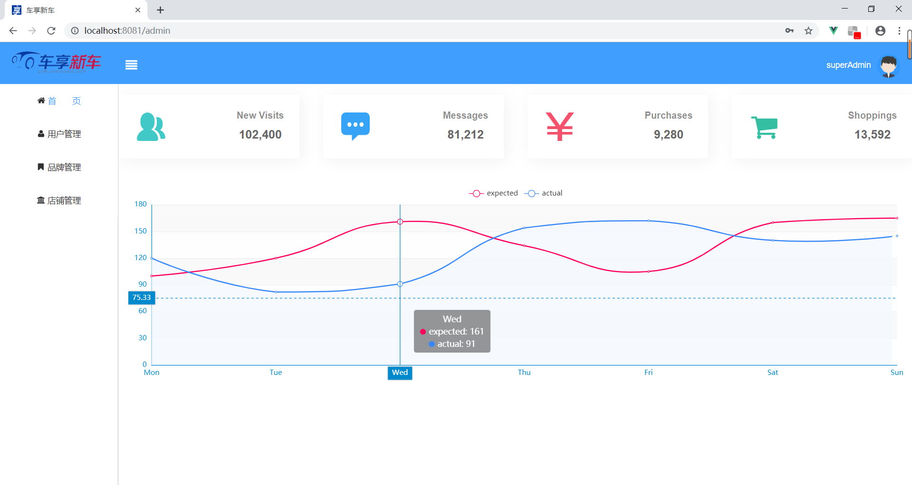

[For English User](./README.md)

一个简单的网上汽车销售系统，大三数据库课程设计小组所做的项目，bug比较多，请谅解。
# 前端
前端是采用vue.js框架与ElemeUI写的.[前端源代码](https://github.com/lamprose/CarShop/tree/browser)
# 后端
后端基于SpringBoot编写.[后端源代码](https://github.com/lamprose/CarShop/tree/server)

---
## 截图

#### 主页：

#### 管理员界面：

## 许可证
[MIT](./LICENSE)  
Copyright (c) 2017-present lamprose
